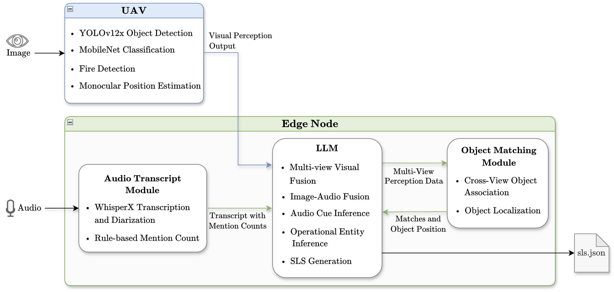

# M2PS: Multi-UAV Multimodal Perception System

---

**Author:** [Maria Leonor Pinto Guedes](https://www.linkedin.com/in/mleonorguedes/)  
**Master's dissertation** in Electrical and Computer Engineering, [FEUP](https://fe.up.pt/)

---

## 📖 About

M2PS is a proof-of-concept Multi-UAV Multimodal Perception System designed to build a semantic perception of emergency scenarios using multi-UAV and multimodal data, while supporting the generation of structured Service Level Specifications (SLSs). The system combines UAV-side visual perception with edge-node multimodal processing. UAVs detect and localize relevant entities, such as people and vehicles, in aerial imagery, while the edge node aggregates multi-UAV observations, processes emergency audio, and performs cross-view object association and semantic fusion. The resulting information is interpreted through LLM semantic reasoning to generate structured SLSs representing relevant entities, their roles, locations, and estimated communication requirements.

---

## ⚙️ Architecture
M2PS pipeline:



---

## 📁 Repository structure

```text
multi-agent-perception-flying-networks/
├─ perception/
│  ├─ vision/       → UAV-side visual perception from aerial images and telemetry
│  └─ audio/        → emergency audio transcription and cue extraction
├─ fusion/          → edge-node fusion, cross-view association, LLM reasoning and SLS generation
├─ evaluation/      → ground truth data, evaluation scripts and experimental results
├─ output/          → generated run outputs
└─ scripts/         → batch execution and manifest generation utilities
```

---

## 📚 Component documentation

For detailed usage, see the component-level documentation:

- [`perception/vision/`](perception/vision/) — visual detection, vehicle classification, fire detection and localization
- [`perception/audio/`](perception/audio/) — WhisperX transcription and audio cue extraction
- [`fusion/`](fusion/) — edge-node fusion, LLM orchestration, post-processing and SLS generation
- [`evaluation/`](evaluation/) — evaluation data, scripts and generated results

---

## ℹ️ Notes

This repository was developed as part of a master's dissertation on multimodal perception for multi-UAV Flying Networks with LLM-supported reasoning. The implementation is intended as a proof-of-concept.

Some datasets, model weights, generated outputs or local configuration files may be excluded from version control due to size, reproducibility, or environment-specific constraints. When required, each component README indicates where those files should be placed.
